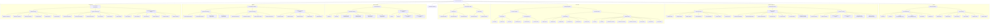

```mermaid
graph TD
    classDef exec fill:#f9f,stroke:#333,stroke-width:2px;
    class CEO,CFO,CIO,COO,VP_Sales,VP_HR,VP_Marketing,VP_Manufacturing exec;

    CEO["Chief Executive Officer"]
    CEO --> Admin["Administrative Assistant"]
    CEO --> CFO["Chief Financial Officer"]
    CEO --> CIO["Chief Information Officer"]
    CEO --> COO["Chief Operating Officer"]
    CEO --> VP_Sales["Vice President of Sales"]
    CEO --> VP_HR["Vice President of HR"]
    CEO --> VP_Marketing["Vice President of Marketing"]
    CEO --> VP_Manufacturing["Vice President of Manufacturing"]

    subgraph Finance
    CFO --> AcctMgr["Accounting Manager"]
    CFO --> FinMgr["Finance Manager"]
        AcctMgr --> Accountant1["Accountant"]
        AcctMgr --> Accountant2["Accountant"]
        AcctMgr --> AR_AP1["Accounts Receivable/Payable Analyst"]
        AcctMgr --> AR_AP2["Accounts Receivable/Payable Analyst"]
        AcctMgr --> Payroll1["Payroll Analyst"]
        AcctMgr --> Payroll2["Payroll Analyst"]
        FinMgr --> Planning1["Planning Analyst"]
        FinMgr --> Planning2["Planning Analyst"]
        FinMgr --> Treasury1["Treasury Analyst"]
        FinMgr --> Treasury2["Treasury Analyst"]
        FinMgr --> Budgeting1["Budgeting Analyst"]
        FinMgr --> Budgeting2["Budgeting Analyst"]
    end

    subgraph "Information Technology"
        CIO --> IT_Ops_Dir["IT Operations Director"]
        CIO --> Mod_Wkpl_Dir["Director of Modern Workplace"]
        CIO --> IT_Sec_Dir["Director of IT Security"]
        IT_Ops_Dir --> SoftwareEngineer1["Software Engineer"]
        IT_Ops_Dir --> SoftwareEngineer2["Software Engineer"]
        IT_Ops_Dir --> SoftwareEngineer3["Software Engineer"]
        IT_Ops_Dir --> SysAdm1["System Administrator"]
        IT_Ops_Dir --> SysAdm2["System Administrator"]
        IT_Ops_Dir --> IT_Service1["IT Service Analyst"]
        IT_Ops_Dir --> IT_Service2["IT Service Analyst"]
        Mod_Wkpl_Dir --> M365_Admin1["Microsoft 365 Administrator"]
        Mod_Wkpl_Dir --> M365_Admin2["Microsoft 365 Administrator"]
        Mod_Wkpl_Dir --> M365_Admin3["Microsoft 365 Administrator"]
        Mod_Wkpl_Dir --> IT_Licensing1["IT Licensing Analyst"]
        Mod_Wkpl_Dir --> IT_Licensing2["IT Licensing Analyst"]
        Mod_Wkpl_Dir --> IT_Licensing3["IT Licensing Analyst"]
        Mod_Wkpl_Dir --> InformationGov["Information Governance and eDiscovery Analyst"]
        IT_Sec_Dir --> CyberSec1["Cybersecurity Analyst"]
        IT_Sec_Dir --> CyberSec2["Cybersecurity Analyst"]
        IT_Sec_Dir --> RiskComp1["Risk and Compliance Analyst"]
        IT_Sec_Dir --> RiskComp2["Risk and Compliance Analyst"]
        IT_Sec_Dir --> Id_Mgmt1["Identity and Access Management Analyst"]
        IT_Sec_Dir --> Id_Mgmt2["Identity and Access Management Analyst"]
    end

    subgraph Procurement
        COO --> ProcDir["Procurement Director"]
        COO --> OperMgr["Operations Manager"]
        ProcDir --> StockMgr["Stock Manager"]
        StockMgr --> StockClerk1["Stock Clerk"]
        StockMgr --> StockClerk2["Stock Clerk"]
        StockMgr --> StockClerk3["Stock Clerk"]
        ProcDir --> PurchMgr["Purchasing Manager"]
        PurchMgr --> PurchClerk1["Purchasing Clerk"]
        PurchMgr --> PurchClerk2["Purchasing Clerk"]
        PurchMgr --> PurchClerk3["Purchasing Clerk"]
        OperMgr --> LogistMgr["Logistics Manager"]
        LogistMgr --> ShipClerk1["Shipping Clerk"]
        LogistMgr --> ShipClerk2["Shipping Clerk"]
        LogistMgr --> ShipClerk3["Shipping Clerk"]
        LogistMgr --> RecvClerk1["Receiving Clerk"]
        LogistMgr --> RecvClerk2["Receiving Clerk"]
        LogistMgr --> RecvClerk3["Receiving Clerk"]
        OperMgr --> FacilMgr["Facilities Manager"]
        FacilMgr --> Custodian1["Custodian"]
        FacilMgr --> Custodian2["Custodian"]
        FacilMgr --> MaintTech_Fac1["Maintenance Technician"]
        FacilMgr --> MaintTech_Fac2["Maintenance Technician"]
        FacilMgr --> MaintTech_Fac3["Maintenance Technician"]
        FacilMgr --> Security1["Security Officer"]
        FacilMgr --> Security2["Security Officer"]
        FacilMgr --> Security3["Security Officer"]
    end

    subgraph Sales
        VP_Sales --> SalesMgrUS["Sales Manager"]
        VP_Sales --> SalesMgrEU["Sales Manager"]
        SalesMgrUS --> SalesRepUS1["Sales Representative"]
        SalesMgrUS --> SalesRepUS2["Sales Representative"]
        SalesMgrUS --> SalesRepUS3["Sales Representative"]
        SalesMgrEU --> SalesRepEU1["Sales Representative"]
        SalesMgrEU --> SalesRepEU2["Sales Representative"]
    end

    subgraph "Human Resources"
        VP_HR --> HROpsMgr["HR Operations Manager"]
        VP_HR --> TalentDevMgr["Talent / Development Manager"]
        HROpsMgr --> HRAnalyst1["HR Analyst"]
        HROpsMgr --> HRAnalyst2["HR Analyst"]
        HROpsMgr --> CompBen1["Compensation and Benefits Specialist"]
        HROpsMgr --> CompBen2["Compensation and Benefits Specialist"]
        HROpsMgr --> HRRep1["Human Resources Representative"]
        HROpsMgr --> HRRep2["Human Resources Representative"]
        TalentDevMgr --> Recruiter1["Recruiter"]
        TalentDevMgr --> Recruiter2["Recruiter"]
        TalentDevMgr --> LearningDev1["Learning / Development Specialist"]
        TalentDevMgr --> LearningDev2["Learning / Development Specialist"]
    end

    subgraph Marketing
        VP_Marketing --> CommMgr["Communications Manager"]
        VP_Marketing --> DigiMgr["Digital Content Manager"]
        VP_Marketing --> MktMgr["Marketing Operations Manager"]
        CommMgr --> CommsSpcl1["Communications Specialist"]
        CommMgr --> CommsSpcl2["Communications Specialist"]
        CommMgr --> PRRep1["Public Relations Representative"]
        CommMgr --> PRRep2["Public Relations Representative"]
        DigiMgr --> SocMed1["Social Media Coordinator"]
        DigiMgr --> SocMed2["Social Media Coordinator"]
        DigiMgr --> Graphics1["Graphics Design Producer"]
        DigiMgr --> Graphics2["Graphics Design Producer"]
        MktMgr --> MktSpcl1["Marketing Specialist"]
        MktMgr --> MktSpcl2["Marketing Specialist"]
        MktMgr --> MktSpcl3["Marketing Specialist"]
        MktMgr --> CRMAdm1["CRM Administrator"]
        MktMgr --> CRMAdm2["CRM Administrator"]
    end

    subgraph Manufacturing
        VP_Manufacturing --> ProdMgr["Production Manager"]
        VP_Manufacturing --> QualMgr["Quality & Safety Manager"]
        VP_Manufacturing --> ManufMgr["Manufacturing Engineering Manager"]
        ProdMgr --> MaintTech_Prod1["Maintenance Technician"]
        ProdMgr --> MaintTech_Prod2["Maintenance Technician"]
        ProdMgr --> MaintTech_Prod3["Maintenance Technician"]
        ProdMgr --> MachOper1["Machine Operator"]
        ProdMgr --> MachOper2["Machine Operator"]
        ProdMgr --> MachOper3["Machine Operator"]
        QualMgr --> QCTech1["Quality Control Technician"]
        QualMgr --> QCTech2["Quality Control Technician"]
        QualMgr --> QCTech3["Quality Control Technician"]
        QualMgr --> SafeTech1["Safety Technician"]
        QualMgr --> SafeTech2["Safety Technician"]
        QualMgr --> SafeTech3["Safety Technician"]
        ManufMgr --> ProcEng1["Process Engineer"]
        ManufMgr --> ProcEng2["Process Engineer"]
        ManufMgr --> ProcEng3["Process Engineer"]
        ManufMgr --> EquipEng1["Equipment Engineer"]
        ManufMgr --> EquipEng2["Equipment Engineer"]
        ManufMgr --> EquipEng3["Equipment Engineer"]
    end
```